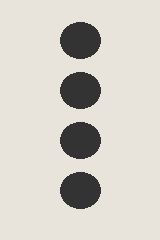

# Sample Module — User Manual

## Overview

The Sample Module is a test fixture for the PDF build. See the [assembly guide](assembly-guide.md), the [PCB file](../hardware/board.kicad_pcb), the [datasheet](https://example.com/datasheet.pdf) and [Good practice](#good-practice).

## Specifications

| | |
|---|---|
| Format | Eurorack, 4HP |
| Power | None |

## Panel

## Good practice

- Use one output per bank.
- Check tuning after patching.
